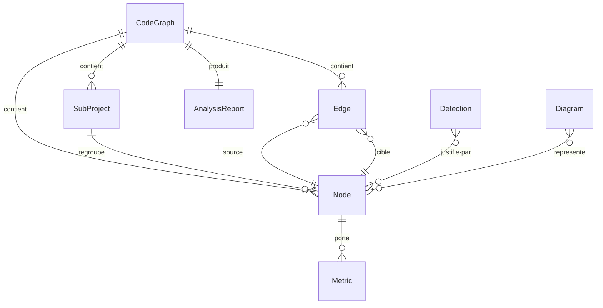

# Data Model: CodeAtlas

**Date**: 2026-07-17 | **Feature**: [spec.md](spec.md) | **Plan**: [plan.md](plan.md)

Le modèle central est le **graphe de code (IR)** : tout ce qui est produit (diagrammes,
métriques, détections, site, rapports) en dérive. Schéma détaillé des types dans
[contracts/ir-schema.md](contracts/ir-schema.md).

## Vue d'ensemble



## Entités

### CodeGraph (racine de l'IR)

Représentation unifiée d'un dépôt analysé.

| Champ | Type | Règles |
| --- | --- | --- |
| `root_path` | chemin POSIX relatif | jamais de chemin absolu dans les sorties (déterminisme) |
| `subprojects` | liste de SubProject | triée par `id` ; ≥ 1 (dépôt simple = 1 sous-projet implicite) |
| `nodes` | mapping `id → Node` | ids uniques, stables (nom qualifié) |
| `edges` | liste d'Edge | triée (source, cible, kind) ; pas de doublon |
| `skipped` | liste de SkippedFile | chemin + raison, triée par chemin |

**Invariants** : toute arête référence deux nœuds existants ; itération toujours en
ordre trié ; sérialisation JSON canonique (clés triées, pas d'horodatage).

### SubProject

Unité détectée dans un monorepo (ou racine unique d'un dépôt simple).

| Champ | Type | Règles |
| --- | --- | --- |
| `id` | slug depuis le chemin relatif | unique, stable |
| `language` | `python` \| `javascript` \| `typescript` \| `java` \| `unknown` | `unknown` → listé non analysé (story 6, scénario 3) |
| `root` | chemin POSIX relatif | aucun chevauchement entre sous-projets |
| `manifest` | chemin du manifeste détecté | pyproject.toml / package.json / pom.xml / build.gradle |
| `declared_deps` | liste d'ids de SubProject | dépendances déclarées vers d'autres sous-projets |

### Node

Élément de code. `kind` ∈ `module` | `package` | `class` | `interface` | `enum` |
`function` | `method` | `attribute`.

| Champ | Type | Règles |
| --- | --- | --- |
| `id` | nom qualifié `subproject/pkg.mod.Cls.meth` | unique, stable entre exécutions |
| `kind` | enum ci-dessus | — |
| `name` | nom court | — |
| `subproject` | id SubProject | obligatoire |
| `location` | fichier (POSIX relatif) + ligne | obligatoire |
| `visibility` | `public` \| `private` | convention du langage (`_`, `#`, modificateurs) |
| `signature` | chaîne normalisée | fonctions/méthodes : params, types, async, défauts |
| `doc` | DocInfo ou vide | brut + résumé (1re ligne) ; format d'origine (docstring/JSDoc/Javadoc) |
| `modifiers` | ensemble trié | `abstract`, `static`, `async`, `exported`… |
| `complexity` | entier ≥ 1 | fonctions/méthodes uniquement, calculé par l'analyseur (R5) |
| `loc` | entier ≥ 0 | lignes de code du symbole |

### Edge

Relation typée entre deux nœuds. `kind` ∈ `inherits` | `implements` | `composes` |
`aggregates` | `associates` | `imports` | `calls` | `references` | `service_dep`.

| Champ | Type | Règles |
| --- | --- | --- |
| `source`, `target` | ids de Node (ou SubProject pour `service_dep`) | doivent exister |
| `kind` | enum ci-dessus | — |
| `certainty` | `certain` \| `inferred` | `inferred` = résolution statique incertaine ; TOUJOURS distingué dans les rendus (FR-009) |
| `location` | fichier + ligne du fait générateur | pour la traçabilité |

### Metric

Mesure rattachée à un nœud (ou agrégée par module/sous-projet).

| Champ | Type | Règles |
| --- | --- | --- |
| `name` | `complexity` \| `loc` \| `fan_in` \| `fan_out` \| `doc_coverage` | extensible |
| `value` | nombre | déterministe (aucune mesure environnementale) |
| `status` | `ok` \| `warn` \| `critical` | dérivé des seuils (défauts R5, surchargables FR-017) |

### Detection

Fait inféré, toujours justifié. `kind` ∈ `layer` | `component` | `pattern` |
`violation` | `dead_code` | `cycle` | `entrypoint`.

| Champ | Type | Règles |
| --- | --- | --- |
| `kind` | enum ci-dessus | — |
| `subject` | ids de nœuds/arêtes concernés | ≥ 1 |
| `evidence` | liste d'indices (élément + explication courte) | ≥ 1 — aucune détection sans preuve (FR-013) |
| `confidence` | `high` \| `medium` \| `low` | ex. code mort public/exporté → confiance dégradée (R7) |
| `detail` | données propres au kind | ex. pattern : nom ; entrypoint : framework, type (route/CLI/main) |

### Diagram

Vue générée depuis l'IR.

| Champ | Type | Règles |
| --- | --- | --- |
| `type` | `class` \| `package_deps` \| `call_flow` \| `architecture` \| `services` | — |
| `scope` | module / symbole focal / global | `call_flow` : point d'entrée ou symbole + `depth` (défaut 3) |
| `format` | `mermaid` (toujours) ; `svg` en option | source .mmd toujours émise (FR-014) |
| `content` | texte Mermaid | déterministe : nœuds/arêtes triés |

### AnalysisReport

Synthèse d'une exécution (FR-020). Champs : compteurs (fichiers analysés/ignorés,
nœuds, arêtes par certitude), avertissements structurés, résultats des seuils en mode
`check`, durée (console uniquement — **jamais** dans les artefacts versionnables).
Sérialisable en JSON (schéma dans [contracts/cli.md](contracts/cli.md)).

## Transitions / cycle de vie

Pipeline sans état persistant, chaque étape étant une fonction pure de la précédente :

```text
sources → [détection sous-projets] → [analyseurs par langage] → CodeGraph
        → [insights : métriques, entrées, détections]           (enrichissement)
        → [renderers : Diagrams]  → [site builder : pages + assets]
        → AnalysisReport (console Rich + JSON optionnel)
```

Aucune mutation après la phase d'enrichissement : les renderers et le site reçoivent un
graphe figé (dataclasses gelées).
