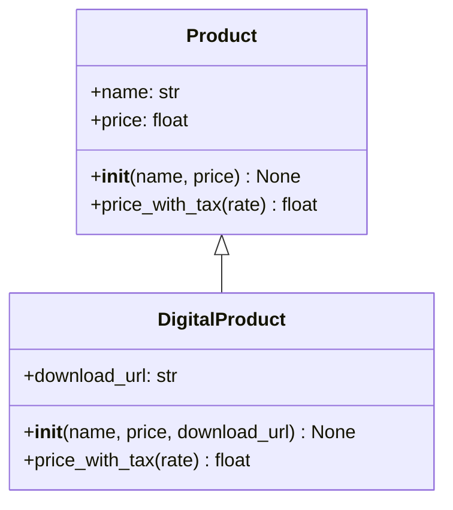

# `shopdemo.models.product`

Produits du catalogue.

## Class diagram

## Classes

### `DigitalProduct`

Produit dématérialisé : livraison instantanée, TVA réduite.

*Source : `shopdemo/models/product.py:29`*

**Attributes**

- `download_url: str`

**Methods**

- `__init__(name: str, price: float, download_url: str) -> None`
- `price_with_tax(rate: float = 0.055) -> float` — La TVA réduite s'applique aux biens numériques.

### `Product`

Un produit physique du catalogue.

Attributes:
    name: nom commercial affiché.
    price: prix unitaire hors taxes, en euros.

*Source : `shopdemo/models/product.py:6`*

**Attributes**

- `name: str`
- `price: float`

**Methods**

- `__init__(name: str, price: float) -> None`
- `price_with_tax(rate: float = 0.2) -> float` — Prix TTC pour un taux de TVA donné.
